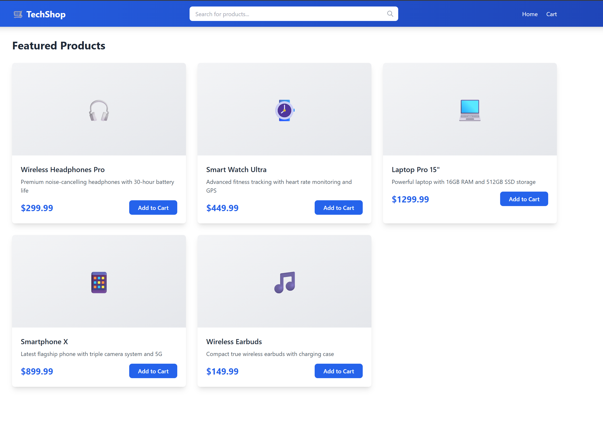
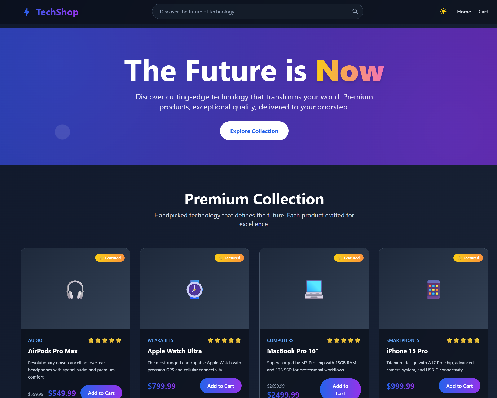
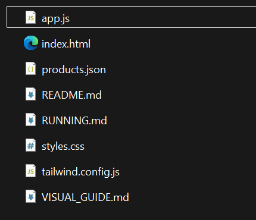
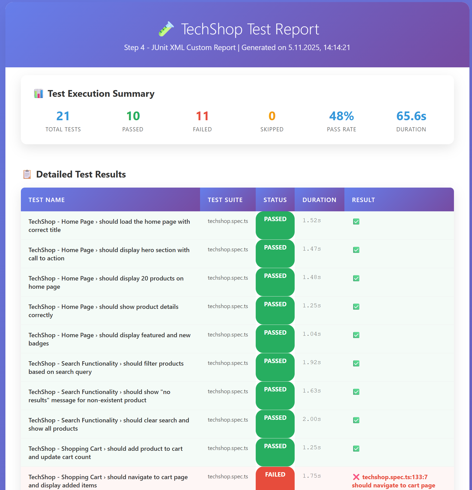
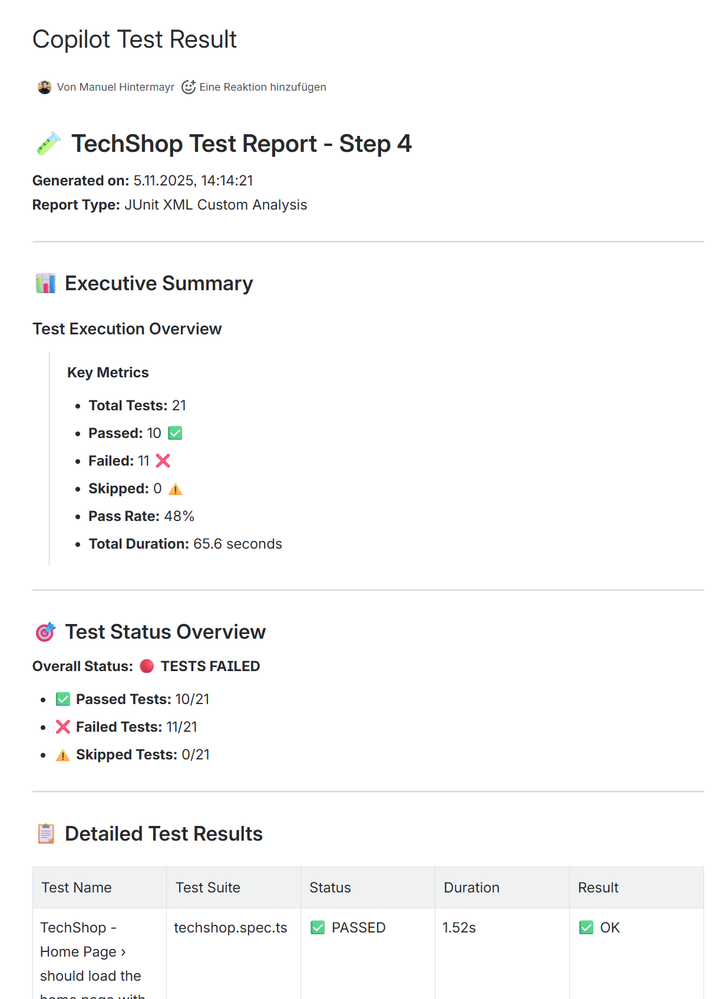

# Test Automation with Copilot/Codex Demo

## Visual Overview

 |  | 
:-------------------------:|:-------------------------:|:-------------------------:
**Step 0:** Basic E-commerce | **Step 1:** Professional TechShop | **Step 2:** Modular Architecture

 |  | 
:-------------------------:|:-------------------------:|:-------------------------:
**Step 3:** E2E Testing | **Step 4:** Custom HTML Report | **Step 4:** Confluence Report

 |  | 
:-------------------------:|:-------------------------:|:-------------------------:
**Step 5:** Page Object Model & CI/CD |  | 

## License
This project is licensed under the MIT License - see the [LICENSE](LICENSE) file for details.

## Overview
This repository demonstrates the capabilities of AI-assisted test automation using GitHub Copilot and OpenAI Codex. It showcases a progressive, step-by-step approach to building comprehensive test automation for a web application.

## Repository Structure

### Step-by-Step Solutions
The repository contains multiple `step_x` folders (step_0, step_1, step_2, ... step_n), where each folder represents an incremental advancement in the test automation journey:

- **step_0** through **step_n**: Each subsequent step builds upon the previous one, adding new test scenarios, patterns, or automation capabilities

Each step folder contains:
- The complete solution code for that step
- A PROMPT.md file documenting the exact prompts used and the results achieved
- A README.md describing what was accomplished in that step
- Any relevant configuration or setup instructions

### System Under Test (SUT)
Located in `step_x/sut/`, this folder contains the application being tested - a fully functional e-commerce webshop - everything mocked. 

## Getting Started

1. Start with `step_0/` folder
2. Review the `step_0/PROMPT.md` to understand the prompts and implementation
3. Explore the System Under Test in `step_0/sut/`
4. Progress through each subsequent step sequentially
5. Each step's PROMPT.md and README.md explain the evolution of the test automation

## Solution Results:

- **step_0**: Initial Playwright project setup and System Under Test (SUT)
  
  
  
  - Contains the `sut/` subfolder with a fully functional e-commerce webshop built with Vue.js 3 and Tailwind CSS
  - Includes Playwright test framework configuration
  - See `step_0/PROMPT.md` for detailed prompts and implementation notes

- **step_1**: Professional TechShop with Vite & Dark Mode
  
  
  
  - Complete visual redesign with futuristic, sales-optimized design
  - Vite development server integration for modern development workflow
  - Dark/Light mode implementation with system preference detection
  - Expanded product catalog from 5 to 20 premium tech products across 10 categories
  - Enhanced UX with glass morphism effects, animations, and professional typography
  - See `step_1/PROMPT.md` for detailed implementation and improvements

- **step_2**: Modular Architecture & Separation of Concerns
  
  
  
  - Refactored monolithic HTML into modular file structure
  - Separated data layer (products.json), presentation layer (styles.css), logic layer (app.js)
  - 52% HTML reduction while maintaining full functionality
  - Better maintainability and testability through separation of concerns
  - Enhanced Tailwind configuration with custom theme
  - See `step_2/PROMPT.md` for architectural transformation details

- **step_3**: Comprehensive E2E Testing with Manual Server Management
  
  
  
  - Complete Playwright test suite with 22+ end-to-end tests covering all functionality
  - Manual server management for full developer control
  - Chromium-only testing for fast development cycles
  - Windows PowerShell optimized commands and workflow
  - Comprehensive test coverage: Home, Search, Cart, Checkout, Navigation, Theme Toggle
  - Visible browser execution (headless: false) for easy debugging
  - See `step_3/PROMPT.md` for testing implementation and configuration details

- **step_4**: JUnit Reporting with Custom HTML & Confluence Reports
  
  
  
  
  
  - Added JUnit XML reporter for CI/CD integration alongside existing HTML reporter
  - Custom Node.js report generator parsing junit.xml to create beautiful HTML reports
  - Professional styled reports with gradients, cards, and comprehensive statistics
  - Confluence-compatible markdown reports ready for copy-paste into documentation
  - Multiple report formats: JUnit XML, Custom HTML, Confluence markdown
  - Automated npm scripts for complete testing and reporting workflow
  - See `step_4/PROMPT.md` for reporting implementation and custom generator details

- **step_5**: Page Object Model Pattern & CI/CD Integration
  
  
  
  - Implemented Page Object Model (POM) design pattern for maintainable test automation
  - Created modular page object classes in utils/ folder with BasePage inheritance
  - Custom test fixtures enabling clean test syntax: `test('name', async ({ home, cart, checkout }) => { ... })`
  - Separated business logic from technical implementation details
  - GitHub Actions CI/CD workflow for automated testing on push/PR
  - Enhanced test readability and maintainability for enterprise-scale automation
  - See `step_5/PROMPT.md` for POM implementation and architectural improvements

## Purpose

This demo illustrates how AI-powered tools can accelerate and enhance test automation development by:
- Generating test code from natural language descriptions
- Creating maintainable test patterns
- Implementing best practices in test automation
- Iteratively building comprehensive test coverage

Each step demonstrates a specific capability or pattern, showing the progression from basic setup to advanced test automation scenarios.
