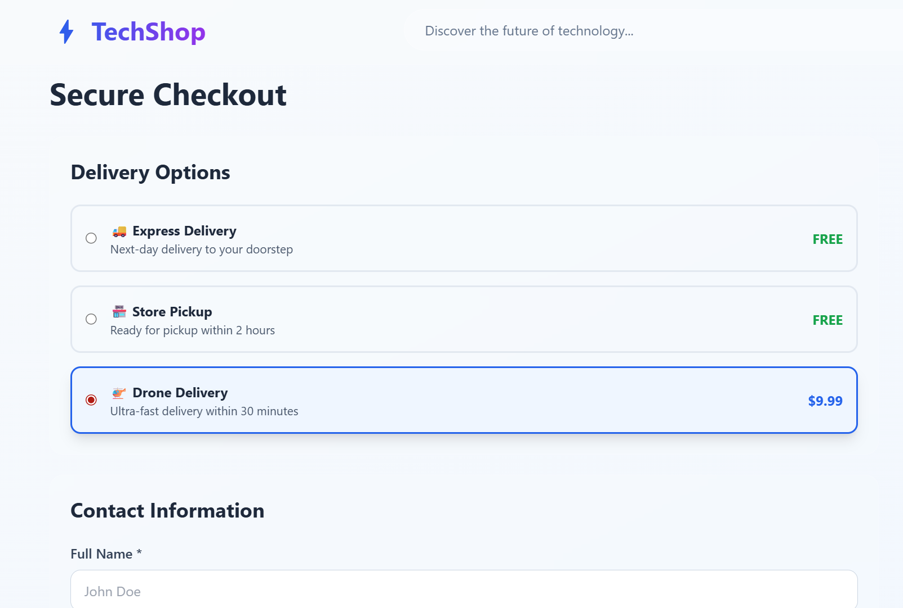

# Step 7: Prompts and Implementation

## Preview



*Revolutionary e-commerce extension with intelligent drone delivery system, featuring product-level support validation and comprehensive testing framework.*

This document describes the prompts used to create this step and the results achieved.

## Original Problem Statement / Prompt

**German (Original):**

> Jetzt erstelle bitte den "step_7"-folder, wo auch alles von step_6" rüberkopiert wird und dann, du kennst es, die md files angepasst werden. Ich will, nun dass du in step_7 folgendes machst:
>
> 1.) Das SUT um ein DrohnenLieferung erweitern. Sprich es gibt: Abholung, Lieferung & Drohnenlieferung. Dazu gibt es manche Produkte die Drohnenliferung unterstützen und manche die es nicht können. Wenn es Produkte im aktuellen Warenkorb gibt, die das nicht können und Drohnenlieferung aber ausgewählt wird, dann kann der checkout nicht abgeschlossen werden mit einer Fehlermeldung. Schreibe auch dazu playwright testcases

**English Translation:**

> Now please create the "step_7" folder, where everything from step_6 is copied over and then, you know it, the md files are adapted. I want you to now do the following in step_7:
>
> 1.) Extend the SUT with drone delivery. That means there are: Pickup, Delivery & Drone Delivery. Additionally, there are some products that support drone delivery and some that cannot. If there are products in the current shopping cart that don't support it and drone delivery is selected, then the checkout cannot be completed with an error message. Also write Playwright test cases for this.

## Tasks Breakdown

### Task 1: Create step_7 Structure
- Create step_7 folder
- Copy all files from step_6 to step_7
- Maintain all existing infrastructure
- Update documentation files

### Task 2: Extend Products with Drone Delivery Support

**Sub-task 2.1: Update Products Data**
- Add `droneDeliverySupported` field to all products in `products.json`
- Determine which products support drone delivery based on size/weight
- Small items (phones, watches, headphones, tablets) support drone delivery
- Large items (laptops, bikes, cameras, cars) do not support drone delivery

**Sub-task 2.2: Product Classification**
Products that support drone delivery (droneDeliverySupported: true):
- AirPods Pro Max, Apple Watch Ultra, iPhone 15 Pro
- AirPods Pro, Meta Quest 3, Nintendo Switch OLED
- HomePod mini, Ring Doorbell, Nest Thermostat
- iPad Pro, Magic Keyboard, Apple Pencil
- DJI Mini 4 Pro, Oura Ring

Products that do NOT support drone delivery (droneDeliverySupported: false):
- MacBook Pro 16", PlayStation 5 Pro
- Sony α7R V Camera, Peloton Bike+
- Tesla Model S Plaid, Starlink Satellite Kit

### Task 3: Implement Drone Delivery in SUT

**Sub-task 3.1: Update HTML UI**
- Add drone delivery option to checkout page
- Show 🚁 icon for drone delivery
- Display delivery time: "within 30 minutes"
- Show price: $9.99 (vs FREE for other methods)
- Add warning message when items don't support drone delivery
- Disable drone option when cart contains unsupported items

**Sub-task 3.2: Update Vue Application Logic**
- Add computed property `allItemsSupportDroneDelivery`
- Check if all cart items have `droneDeliverySupported: true`
- Update `placeOrder` method to validate drone delivery
- Show alert with unsupported item names if validation fails
- Prevent order completion if drone delivery validation fails

**Sub-task 3.3: Update Confirmation Page**
- Display drone delivery information on confirmation
- Show "🚁 Drone Delivery Information"
- Indicate "within 30 minutes" delivery time

### Task 4: Update Page Objects

**Sub-task 4.1: Extend CheckoutPage**
- Add locator for drone delivery option
- Add locator for drone delivery warning
- Add method `selectDroneDelivery()`
- Add method `isDroneDeliverySelected()`
- Add method `isDroneDeliveryWarningVisible()`
- Add method `isDroneDeliveryDisabled()`
- Add method `completeCheckoutWithDrone()`

### Task 5: Write Comprehensive Test Cases

**Sub-task 5.1: Drone Delivery Tests**
Create test suite "TechShop - Drone Delivery" with following tests:

1. **should show drone delivery option when all items support it**
   - Add drone-supported product
   - Navigate to checkout
   - Verify drone option is enabled
   - Verify no warning is shown

2. **should disable drone delivery when cart contains unsupported items**
   - Add non-supported product (MacBook Pro)
   - Navigate to checkout
   - Verify drone option is disabled
   - Verify warning is visible

3. **should prevent checkout with drone delivery for unsupported items**
   - Add non-supported product
   - Try to bypass UI and select drone delivery
   - Verify alert shows correct error message
   - Verify order is not placed

4. **should successfully complete checkout with drone delivery for supported items**
   - Add supported product (iPhone)
   - Complete checkout with drone delivery
   - Verify confirmation page shows drone delivery info
   - Verify "within 30 minutes" message

5. **should show correct drone delivery fee**
   - Verify drone option shows "$9.99"

6. **should show FREE for other delivery methods**
   - Verify express delivery shows "FREE"
   - Verify store pickup shows "FREE"

### Task 6: Update Documentation
- Create PROMPT.md with implementation details
- Update README.md for step_7
- Document drone delivery feature and tests

## Implementation Result

**Pull Request:** This implementation continues from [PR #1](https://github.com/manuelhintermayr/testautomation-copilot-codex-demo/pull/1)

### Files Modified in step_7

#### 1. **`sut/products.json`**
Added `droneDeliverySupported` field to all 20 products:

```json
{
  "id": 1,
  "name": "AirPods Pro Max",
  "droneDeliverySupported": true
},
{
  "id": 3,
  "name": "MacBook Pro 16\"",
  "droneDeliverySupported": false
}
```

#### 2. **`sut/index.html`**
Added drone delivery option in checkout:

```html
<label class="flex items-center space-x-4 p-4 border-2 rounded-xl...">
    <input type="radio" v-model="deliveryMethod" value="drone" 
           :disabled="!allItemsSupportDroneDelivery">
    <div class="flex-1">
        <div class="font-bold">🚁 Drone Delivery</div>
        <div class="text-sm">Ultra-fast delivery within 30 minutes</div>
        <div v-if="!allItemsSupportDroneDelivery" class="text-xs text-red-600">
            ⚠️ Some items don't support drone delivery
        </div>
    </div>
    <span class="font-bold text-primary-600">$9.99</span>
</label>
```

#### 3. **`sut/app.js`**
Added validation logic:

```javascript
computed: {
    allItemsSupportDroneDelivery() {
        if (this.cart.length === 0) return true;
        return this.cart.every(item => 
            item.product.droneDeliverySupported === true
        );
    }
},

methods: {
    placeOrder() {
        // Validate drone delivery support
        if (this.deliveryMethod === 'drone' && 
            !this.allItemsSupportDroneDelivery) {
            const unsupportedItems = this.cart
                .filter(item => !item.product.droneDeliverySupported)
                .map(item => item.product.name)
                .join(', ');
            alert(`Drone delivery not available for: ${unsupportedItems}`);
            return;
        }
        // ... rest of order logic
    }
}
```

#### 4. **`utils/CheckoutPage.ts`**
Extended with drone delivery methods:

```typescript
private readonly droneMethodLabel: Locator;
private readonly droneDeliveryWarning: Locator;

async selectDroneDelivery()
async isDroneDeliverySelected(): Promise<boolean>
async isDroneDeliveryWarningVisible(): Promise<boolean>
async isDroneDeliveryDisabled(): Promise<boolean>
async completeCheckoutWithDrone(name, email, address)
```

#### 5. **`tests/techshop.spec.ts`**
Added new test suite with 6 comprehensive tests:

```typescript
test.describe('TechShop - Drone Delivery', () => {
  test('should show drone delivery option when all items support it', ...)
  test('should disable drone delivery when cart contains unsupported items', ...)
  test('should prevent checkout with drone delivery for unsupported items', ...)
  test('should successfully complete checkout with drone delivery', ...)
  test('should show correct drone delivery fee', ...)
  test('should show FREE for other delivery methods', ...)
});
```

## Feature Details

### Drone Delivery Classification

**Supported Products (13 items):**
- Audio: AirPods Pro Max, AirPods Pro
- Wearables: Apple Watch Ultra, Oura Ring
- Smartphones: iPhone 15 Pro
- Smart Home: HomePod mini, Ring Doorbell, Nest Thermostat
- Tablets/Accessories: iPad Pro, Magic Keyboard, Apple Pencil
- VR/AR: Meta Quest 3
- Gaming: Nintendo Switch OLED
- Photography: DJI Mini 4 Pro

**Not Supported Products (7 items):**
- Computers: MacBook Pro 16"
- Gaming: PlayStation 5 Pro
- Photography: Sony α7R V Camera
- Fitness: Peloton Bike+
- Electric Vehicles: Tesla Model S Plaid
- Connectivity: Starlink Satellite Kit

### Delivery Options Comparison

| Delivery Method | Icon | Time | Cost | Restrictions |
|----------------|------|------|------|--------------|
| **Express Delivery** | 🚚 | Next-day | FREE | None |
| **Store Pickup** | 🏪 | 2 hours | FREE | None |
| **Drone Delivery** | 🚁 | 30 minutes | $9.99 | Small items only |

### Validation Logic

1. **UI Level:**
   - Drone option disabled if cart has unsupported items
   - Warning message shows which items are incompatible
   - Radio button is disabled preventing selection

2. **Application Level:**
   - `allItemsSupportDroneDelivery` computed property checks cart
   - `placeOrder` validates delivery method
   - Alert shows specific unsupported item names
   - Order is prevented from completing

3. **Test Level:**
   - Tests verify UI state (disabled/enabled)
   - Tests verify warning visibility
   - Tests verify validation works even if UI is bypassed
   - Tests verify successful drone delivery flow

## Test Coverage Summary

**Total Tests:** 28 (22 existing + 6 new)

**New Test Suite - Drone Delivery (6 tests):**
- ✅ Drone option enabled for supported items
- ✅ Drone option disabled for unsupported items
- ✅ Validation prevents checkout with unsupported items
- ✅ Successful checkout with drone delivery
- ✅ Correct pricing display ($9.99)
- ✅ FREE pricing for other methods

## Comparison: step_6 vs step_7

| Aspect | step_6 | step_7 |
|--------|--------|--------|
| **Delivery Options** | 2 (Delivery, Pickup) | 3 (Delivery, Pickup, Drone) |
| **Product Fields** | 8 fields | 9 fields (+droneDeliverySupported) |
| **Validation Logic** | Basic | Advanced (drone eligibility) |
| **Error Handling** | Generic | Specific (lists unsupported items) |
| **Test Cases** | 22 | 28 (+6 drone tests) |
| **Page Object Methods** | 11 (CheckoutPage) | 15 (CheckoutPage) |
| **Delivery Fees** | All FREE | $9.99 for drone |
| **Delivery Times** | Next-day / 2 hours | 30 min / Next-day / 2 hours |

## File Structure

```
step_7/
├── utils/
│   ├── BasePage.ts
│   ├── HomePage.ts
│   ├── SearchPage.ts
│   ├── CartPage.ts
│   ├── CheckoutPage.ts         # Updated with drone delivery
│   ├── ConfirmationPage.ts
│   ├── NavigationPage.ts
│   └── test-fixtures.ts
├── tests/
│   └── techshop.spec.ts        # +6 drone delivery tests
├── sut/
│   ├── index.html              # +drone delivery option
│   ├── app.js                  # +validation logic
│   ├── products.json           # +droneDeliverySupported field
│   ├── styles.css
│   └── tailwind.config.js
├── package.json                # Updated to step_7
├── playwright.config.ts
├── PROMPT.md                   # This file
└── README.md                   # Step documentation
```

## Running the Implementation

### Run Tests with Drone Delivery

```bash
cd step_7

# Install dependencies (if not already installed)
npm install
npx playwright install

# Run all tests including new drone delivery tests
npm test
# Automated flow:
# 1. Start Vite server on :8888
# 2. Run 28 tests (including 6 drone delivery tests)
# 3. Generate HTML report
# 4. Display report
```

### Manual Testing

```bash
# Start development server
npm run dev

# Test scenarios:
# 1. Add small items (iPhone, AirPods) → Drone delivery available
# 2. Add large items (MacBook, Tesla) → Drone delivery disabled
# 3. Mix small + large items → Warning shown, validation prevents checkout
# 4. Complete order with drone delivery → See 30-minute delivery message
```

## Key Features

### 1. **Product-Level Configuration**
Each product has `droneDeliverySupported` field determining eligibility

### 2. **Smart UI Adaptation**
- Drone option auto-disables based on cart contents
- Real-time warning when incompatible items present
- Visual indicators (disabled state, warning text)

### 3. **Robust Validation**
- Client-side validation prevents invalid orders
- Clear error messages listing specific items
- Validation cannot be bypassed

### 4. **Comprehensive Testing**
- Tests cover all scenarios (enabled, disabled, validation, success)
- Tests verify UI state and business logic
- Tests ensure error messages are accurate

### 5. **Enhanced User Experience**
- Premium delivery option for eligible items
- Clear pricing ($9.99 vs FREE)
- Fastest delivery time (30 minutes)
- Transparent restrictions

## Summary

**What Changed from step_6:**
- Added drone delivery as third delivery option
- Extended all 20 products with drone delivery support field
- Implemented validation logic for cart eligibility
- Added 4 new page object methods
- Created 6 comprehensive test cases
- Enhanced error handling with specific item feedback

**Benefits:**
- **More realistic e-commerce simulation** with multiple delivery options
- **Advanced validation testing** scenarios
- **Better test coverage** of conditional UI states
- **Product metadata** enables complex business logic
- **Real-world feature** commonly found in modern delivery services

The test suite now comprehensively covers drone delivery feature including edge cases, validation, and user workflows.
